# Deploying a Multi-Container Application with Docker Compose (PUKU CLI)

## Table of Contents

- [Introduction](#introduction)
- [Learning Objectives](#learning-objectives)
- [Prologue: The Challenge](#prologue-the-challenge)
- [Environment Setup](#environment-setup)
- [Chapters](#chapters)
  - [Chapter 1: Docker Compose Component](#chapter-1-docker-compose-component)
  - [Chapter 2: Docker Network](#chapter-2-docker-network)
  - [Chapter 3: Docker Volume](#chapter-3-docker-volume)
  - [Chapter 4: Application Components](#chapter-4-application-components)
  - [Chapter 5: Complete Application Workflow](#chapter-5-complete-application-workflow)
  - [Chapter 6: Deployment and Automation using PUKU CLI](#chapter-6-deployment-and-automation-using-puku-cli)
  - [Chapter 7: Verifying the End-to-End Behaviour](#chapter-7-verifying-the-end-to-end-behaviour)
  - [Chapter 8: The Request Lifecycle](#chapter-8-the-request-lifecycle)
- [Epilogue: The Complete System](#epilogue-the-complete-system)
- [The Principles](#the-principles)
- [Troubleshooting](#troubleshooting)
- [Next Steps](#next-steps)
- [Additional Resources](#additional-resources)

## Introduction

This lab will deploy a small but **real** multi-container application: a Flask web front-end that talks to a Redis back-end. The two services run in **separate containers**, are joined by a **user-defined Docker network**, and Redis's data is held on a **named Docker volume** ensuring visit counter survives restarts. Described declaratively in a single `compose.yaml` file, and the whole stack is brought up with one command.

Using **PUKU CLI** as the primary driver, work as a thin wrapper around the standard `docker` and `docker compose` tooling that adds project-aware shortcuts, friendlier defaults, and one-command workflows.

## Learning Objectives
By the end of this lab, you will be able to:

1. Explain the role of a `Dockerfile` and how an image becomes a running container.
2. Author a `compose.yaml` that defines **multiple services**, a **user-defined network**, and a **named volume**.
3. Use Docker's embedded DNS to let containers resolve each other by **service name**.
4. Configure **persistent storage** with a named volume and verify that data survives container restarts.
5. Operate a Docker Compose stack from the **PUKU CLI**: build, up, logs, exec, down, and recreate.
6. Map each line of `compose.yaml` to a concrete behaviour you can observe from the terminal.

**Prerequisites:** Familiarity with Docker and basic understanding of containerization

## Prologue: The Challenge

Deploying a modern application means managing multiple moving parts at once a frontend web page, a backend API, and a database. Configuring them manually one by one, is slow, tedious, and easy to make mistakes with ports and passwords.

Modern DevOps relies on automation. The catch:

- The app is split into **two** processes that must run side-by-side (Flask + Redis).
- Restarts the Redis container **must not lose** the visit count.
- The reviewer will only run **one command** to bring the whole thing up.
- Simultaneously initialize and deploy the frontend, backend, and database containers from a unified configuration using **PUKU CLI**
- Automation in Deployment using **PUKU CLI**.

Your task is to turn a complex, multi-step deployment into a single, flawless automated command using PUKU CLI.

## Environment Setup

## Part 1: System Update
Update your environment and install required packages:
```bash
sudo apt update && sudo apt upgrade -y
```
## Part 2: Install Node.js & npm
Need Nodejs and npm for PUKU CLI

### 2.1 Install Prerequisites :
```bash
sudo apt install -y curl upgrade-software-properties apt-transport-https ca-certificates gnupg
```
### 2.2 Download and import the NodeSource GPG key :
```bash
sudo mkdir -p /etc/apt/keyrings
curl -fsSL https://deb.nodesource.com/gpgkey/nodesource-repo.gpg.key | sudo gpg --dearmor -o /etc/apt/keyrings/nodesource.gpg
```
### 2.3 Create the repository source list :
```bash
NODE_MAJOR=20
echo "deb [signed-by=/etc/apt/keyrings/nodesource.gpg] https://deb.nodesource.com/node_$NODE_MAJOR.x nodistro main" | sudo tee /etc/apt/sources.list.d/nodesource.list
```
### 2.4 Install NodeJs : 
```bash
sudo apt update
sudo apt install nodejs -y
```
### 2.5 Verify Installation : 
```bash
node -v
npm -v
```

## Part 3: Install Docker and Docker Compose
### 3.1 Add Docker's official GPG key : 
```bash
sudo mkdir -p /etc/apt/keyrings
curl -fsSL https://download.docker.com/linux/ubuntu/gpg | sudo gpg --dearmor -o /etc/apt/keyrings/docker.gpg
```
### 3.2 Set up the Docker Repository : 
```bash
echo \
  "deb [arch=$(dpkg --print-architecture) signed-by=/etc/apt/keyrings/docker.gpg] https://download.docker.com/linux/ubuntu \
  $(lsb_release -cs) stable" | sudo tee /etc/apt/sources.list.d/docker.list > /dev/null
  ```
  ### 3.3 Install Docker and Plugins : 
  ```bash
  sudo apt update
sudo apt install docker-ce docker-ce-cli containerd.io docker-buildx-plugin docker-compose-plugin -y
```

## Part 4: Manage Docker as a Non Root user 
### 4.1 Create Docker Group : 
```bash
sudo groupadd docker
```
### 4.2 Add Current user to the Docker Group : 
```bash
sudo usermod -aG docker $USER
```
### 4.3 Update your current Terminal Session : 
```bash
newgrp docker
```

## Part 5: Installing Puku CLI
### 5.1 Installation : 
```bash
npm install -g @puku/puku-cli
```
### 5.2 Verify Installation :
```bash
puku --version         
```

If any of them fail, install or update before proceeding:

| Tool         | Minimum version | How to install (typical)                                  |
|--------------|-----------------|-----------------------------------------------------------|
| Docker       | 24.0            | Docker Desktop: <https://www.docker.com/products/docker-desktop> |
| Compose v2   | 2.20            | Bundled with Docker Desktop                                |
| PUKU CLI     | latest          | Visit https://puku.sh/puku-cli          |


## Chapter 1: Docker Compose Component

Docker Compose is a tool that simplifies the deployment and management of multi-container Docker applications. Docker Compose is used to deploy a Flask web application alongside a Redis database.

---

## 1.1 Overview of Docker Compose Architecture

The application consists of two independent containers that work together:

- **Flask Container (Web Service)**
  - Runs the Python Flask application.
  - Receives HTTP requests from users.
  - Connects to Redis to store and retrieve the visit counter.

- **Redis Container**
  - Stores the visit counter.
  - Persists data using a Docker Volume.
  - Accepts connections only from containers inside the Docker network.

Docker Compose automatically creates:

- One custom bridge network
- One persistent Docker volume
- Two containers
- One custom Docker image (Flask)
- Internal DNS for service communication

The overall workflow is shown below:

```
Browser
   │
   │ HTTP Request
   ▼
Host Port 5000
   │
   ▼
Flask Container (Port 80)
   │
   │ Redis Request
   ▼
Redis Container (Port 6379)
   │
   ▼
Docker Volume
```

---

## 1.2 Dockerfile

The `Dockerfile` contains instructions that Docker follows to build the Flask application image.

```dockerfile
# syntax=docker/dockerfile:1
FROM python:3.11-slim      # small, Debian-based Python image

WORKDIR /app               # everything happens in /app inside the image

# Install dependencies first to leverage Docker layer caching
COPY requirements.txt .
RUN pip install --no-cache-dir -r requirements.txt

# Copy the application source
COPY app.py .

# Drop privileges: run as the unprivileged `appuser`
RUN useradd -m appuser
USER appuser

EXPOSE 80                  # documents that the container listens on 80

CMD ["python", "app.py"]   # default start command
```

### Explanation

```dockerfile
# syntax=docker/dockerfile:1
```

### Purpose

Specifies the Dockerfile syntax version.

### Explanation

- Enables modern Dockerfile features.
- Ensures compatibility with Docker BuildKit.

---

```dockerfile
FROM python:3.11-slim
```

### Purpose

Selects the base image for the application.

### Explanation

- Uses the official Python 3.11 image.
- The **slim** variant is lightweight.
- Includes Python while minimizing unnecessary packages.

This becomes the operating system inside the container.

---

```dockerfile
WORKDIR /app
```

### Purpose

Sets the working directory inside the container.

### Explanation

After this instruction:

- All following commands execute inside `/app`.
- If the directory does not exist, Docker automatically creates it.

Directory structure:

```
/
└── app/
```

---

```dockerfile
COPY requirements.txt .
```

### Purpose

Copies the dependency file into the container.

### Explanation

Only `requirements.txt` is copied first.

This improves Docker layer caching because dependencies only reinstall when this file changes.

---

```dockerfile
RUN pip install --no-cache-dir -r requirements.txt
```

### Purpose

Installs Python packages.

### Explanation

- Reads all required packages from `requirements.txt`
- Downloads and installs Flask, Redis, and any other dependencies.
- `--no-cache-dir` removes pip cache after installation to reduce image size.

---

```dockerfile
COPY app.py .
```

### Purpose

Copies the Flask application into the image.

### Explanation

After dependencies are installed, only the application source code is copied.

This avoids reinstalling packages every time the application code changes.

---

```dockerfile
RUN useradd -m appuser
```

### Purpose

Creates a non-root user.

### Explanation

Running applications as root is considered insecure.

This command creates a regular Linux user named:

```
appuser
```

---

```dockerfile
USER appuser
```

### Purpose

Switches the execution user.

### Explanation

All future commands and the running application execute as `appuser` instead of root.

This follows Docker security best practices.

---

```dockerfile
EXPOSE 80
```

### Purpose

Documents the application's listening port.

### Explanation

This tells Docker that the application listens on port **80** inside the container.

It does **not** publish the port.

Port publishing is handled later by Docker Compose.

---

```dockerfile
CMD ["python", "app.py"]
```

### Purpose

Defines the default startup command.

### Explanation

Whenever a container starts from this image, Docker automatically executes:

```bash
python app.py
```

which launches the Flask application.

---

## 1.3 compose.yml

The `compose.yml` file defines the complete multi-container application.

```yaml
services:
  web:
    build: .
    image: poridhi-flask:latest
    container_name: poridhi-web

    ports:
      - "5000:80"

    environment:
      - NAME=Poridhi Intern

    networks:
      - app-net

    depends_on:
      - redis

    restart: unless-stopped

  redis:
    image: redis:7-alpine
    container_name: poridhi-redis

    networks:
      - app-net

    volumes:
      - redis-data:/data

    command: ["redis-server", "--appendonly", "yes"]

    restart: unless-stopped

networks:
  app-net:
    driver: bridge
    name: poridhi-net

volumes:
  redis-data:
    name: poridhi-redis-data
```

---

### Services Section

```yaml
services:
```

### Purpose

Defines all containers that belong to the application.

In this project there are two services:

- web
- redis

Each service becomes its own Docker container.

---

### Web Service

```yaml
web:
```

Represents the Flask application container.

---

### Build

```yaml
build: .
```

### Purpose

Builds the Docker image using the Dockerfile in the current directory.

Docker automatically executes every instruction inside the Dockerfile.

---

### Image

```yaml
image: poridhi-flask:latest
```

### Purpose

Assigns a name to the built image.

Resulting image:

```
poridhi-flask:latest
```

This image can later be reused without rebuilding.

---

### Container Name

```yaml
container_name: poridhi-web
```

### Purpose

Assigns a fixed container name.

Without this option Docker generates random names.

Instead, the container becomes:

```
poridhi-web
```

---

### Port Mapping

```yaml
ports:
  - "5000:80"
```

### Purpose

Publishes the application to the host machine.

Meaning:

```
Host Port      Container Port
5000     --->      80
```

Users access:

```
http://localhost:5000
```

Docker forwards traffic internally to port 80 inside the container.

---

### Environment Variables

```yaml
environment:
  - NAME=Poridhi Intern
```

### Purpose

Provides runtime configuration.

Inside the container:

```
NAME = Poridhi Intern
```

The Flask application later reads this value using:

```python
os.getenv("NAME")
```

Result:

```
Hello Poridhi Intern!
```

---

### Network

```yaml
networks:
  - app-net
```

### Purpose

Connects the container to the custom Docker bridge network.

Containers connected to the same network can communicate securely using service names instead of IP addresses.

---

### Dependency

```yaml
depends_on:
  - redis
```

### Purpose

Controls startup order.

Docker starts:

```
Redis
    ↓
Flask
```

However, it only ensures that Redis starts first—it does **not** wait until Redis is fully ready to accept connections.

---

### Restart Policy

```yaml
restart: unless-stopped
```

### Purpose

Automatically restarts the container if it crashes or if Docker restarts.

The container only remains stopped if the user manually stops it.

---

### Redis Service

```yaml
redis:
```

Defines the Redis database container.

---

### Redis Image

```yaml
image: redis:7-alpine
```

Uses the official Redis image.

The Alpine variant is lightweight and optimized for small container size.

---

### Container Name

```yaml
container_name: poridhi-redis
```

Creates a container named:

```
poridhi-redis
```

---

### Network

```yaml
networks:
  - app-net
```

Connects Redis to the same bridge network as the Flask container.

This allows Flask to communicate with Redis using the hostname:

```
redis
```

---

### Persistent Storage

```yaml
volumes:
  - redis-data:/data
```

### Purpose

Stores Redis data permanently.

Without this volume:

```
Container Deleted
      ↓
Data Lost
```

With the volume:

```
Container Deleted
      ↓
Data Preserved
```

The visit counter survives container recreation.

---

### Command

```yaml
command:
  ["redis-server", "--appendonly", "yes"]
```

### Purpose

Starts Redis with Append-Only File (AOF) persistence enabled.

Instead of keeping data only in memory, every write operation is recorded on disk.

This improves durability and helps recover data after a restart.

---

### Restart Policy

```yaml
restart: unless-stopped
```

Automatically restarts Redis if it unexpectedly stops.

---

## Chapter 2: Docker Network

```yaml
networks:
  app-net:
```

Defines a custom Docker bridge network.

---

### Driver

```yaml
driver: bridge
```

The bridge driver creates an isolated virtual network where containers can communicate securely.

Only containers attached to this network can access one another using Docker's internal networking.

---

### Network Name

```yaml
name: poridhi-net
```

Assigns a stable name to the Docker network.

Instead of a randomly generated name, Docker creates:

```
poridhi-net
```

This makes the network easier to identify and reuse.

---

## Chapter 3: Docker Volume

```yaml
volumes:
  redis-data:
```

Defines a named Docker volume.

---

### Volume Name

```yaml
name: poridhi-redis-data
```

Creates a persistent storage location managed by Docker.

Unlike data stored inside a container, a named volume continues to exist even if the Redis container is removed.

This ensures that application data such as the visit counter is preserved across container restarts and recreations.

---

## Chapter 4: Application Components

The Flask application handles incoming HTTP requests and communicates with the Redis service to maintain a persistent page visit counter.

```python
import os
import socket
from flask import Flask
from redis import Redis, RedisError

app = Flask(__name__)

# "redis" is the SERVICE NAME from compose.yaml.
# Docker's embedded DNS on the user-defined network resolves it
# to the redis container's IP — no hard-coded host needed.
redis = Redis(host="redis", port=6379, socket_connect_timeout=2)


@app.route("/")
def hello():
    try:
        visits = redis.incr("counter")
    except RedisError:
        # Back-end is down? Still serve the page so the demo keeps working.
        visits = "<i>could not connect to Redis, counter disabled</i>"

    html = (
        "<h3>Hello {name}!</h3>"
        "<b>Hostname:</b> {hostname}<br/>"
        "<b>Visits:</b> {visits}"
    )

    return html.format(
        name=os.getenv("NAME", "world"),
        hostname=socket.gethostname(),
        visits=visits,
    )


if __name__ == "__main__":
    # Bind to 0.0.0.0 so the container's port 80 is reachable from the host.
    app.run(host="0.0.0.0", port=80)
```

---

## 4.1 Import Statements

```python
import os
import socket
from flask import Flask
from redis import Redis, RedisError
```

### Explanation

These modules provide the functionality required by the application:

- `os` reads environment variables.
- `socket` retrieves the container's hostname.
- `Flask` creates the web application.
- `Redis` connects to the Redis server.
- `RedisError` handles Redis connection failures.

---

## 4.2 Create Flask Application

```python
app = Flask(__name__)
```

Creates a Flask application instance.

All routes and configurations are registered with this application object.

---

## 4.3 Redis Connection

```python
redis = Redis(
    host="redis",
    port=6379,
    socket_connect_timeout=2
)
```

### Explanation

Creates a Redis client.

Parameters:

| Parameter | Description |
|-----------|-------------|
| host="redis" | Uses the Docker Compose service name as the hostname. Docker's internal DNS automatically resolves `redis` to the Redis container's IP address. |
| port=6379 | Default Redis server port. |
| socket_connect_timeout=2 | Waits a maximum of 2 seconds before reporting a connection failure. |

No hard-coded IP address is required because Docker Compose provides automatic service discovery.

---

## 4.4 Root Route

```python
@app.route("/")
```

Registers the application's home page.

Whenever a user visits:

```
http://localhost:5000/
```

Flask executes the `hello()` function.

---

## 4.5 Visit Counter

```python
visits = redis.incr("counter")
```

The `INCR` command increases the value of the Redis key named `counter` by one every time the page is visited.

Example:

```
First Visit  → 1
Second Visit → 2
Third Visit  → 3
```

---

## 4.6 Exception Handling

```python
except RedisError:
```

If Redis is unavailable, the application does not terminate.

Instead, it displays a message indicating that the counter is disabled while continuing to serve the webpage. This improves the application's reliability and user experience.

---

## 4.7 HTML Response

```python
html = (
    "<h3>Hello {name}!</h3>"
    "<b>Hostname:</b> {hostname}<br/>"
    "<b>Visits:</b> {visits}"
)
```

Creates a simple HTML template that displays:

- Greeting message
- Container hostname
- Current visit count

The placeholders are replaced with actual values before the response is returned.

---

## 4.8 Reading Environment Variables

```python
name = os.getenv("NAME", "world")
```

Reads the `NAME` environment variable supplied by Docker Compose.

If the variable is not defined, the default value `"world"` is used.

This allows the greeting message to be customized without modifying the application code.

---

## 4.9 Container Hostname

```python
socket.gethostname()
```

Retrieves the hostname of the running container.

Since each Docker container has its own hostname, this helps identify which container handled the request.

---

## 4.10 Running the Flask Server

```python
app.run(host="0.0.0.0", port=80)
```

Starts the Flask development server.

- `host="0.0.0.0"` binds the application to all network interfaces, making it accessible from outside the container.
- `port=80` configures the application to listen on port 80 inside the container.

This internal port is exposed to users through Docker Compose using the mapping `5000:80`.

---

## Chapter 5: Complete Application Workflow

The execution flow of the application is as follows:

1. Docker Compose builds the Flask image using the Dockerfile.
2. Docker Compose creates the custom bridge network (`poridhi-net`) and the persistent volume (`poridhi-redis-data`).
3. The Redis container starts and initializes its data storage.
4. The Flask container starts and connects to the Redis service using the hostname `redis`.
5. A user opens `http://localhost:5000` in a web browser.
6. Docker forwards the request from host port **5000** to container port **80**.
7. The Flask application receives the request and increments the `counter` value stored in Redis.
8. Flask reads the environment variable `NAME`, retrieves the container hostname, and generates an HTML response showing the greeting, hostname, and visit count.
9. The response is sent back to the user's browser. Because Redis uses a persistent Docker volume, the visit counter remains available even if the containers are restarted.

## Chapter 6: Deployment and Automation using PUKU CLI

Deploying and managing Docker applications can involve building images, creating networks, starting containers, checking logs, and cleaning up resources.

To simplify this process, **PUKU CLI** provides a collection of wrapper commands around Docker and Docker Compose. Instead of remembering long Docker commands.

In this project, PUKU CLI is used to automate the deployment of the Flask and Redis multi-container application.

---

## 6.1 What is PUKU CLI?

PUKU CLI is a command-line tool that simplifies Docker container management by providing easy-to-use commands for common Docker Compose operations.

Instead of directly interacting with Docker Compose, developers execute PUKU commands that internally invoke the appropriate Docker commands. This abstraction makes deployment easier, especially for beginners and team-based projects where a consistent workflow is required.

Some advantages of using PUKU CLI include:

- Simplified deployment commands
- Faster application startup and shutdown
- Easier monitoring of running containers
- Automates deployment and cleanup.
- Reduced possibility of command errors
- Minimizes configuration errors.
- Reduces repetitive command execution.
- Provides a consistent workflow for development and testing.
- Makes container management easier for beginners.
---

## 6.2 Deployment Workflow

The deployment process follows several sequential steps.

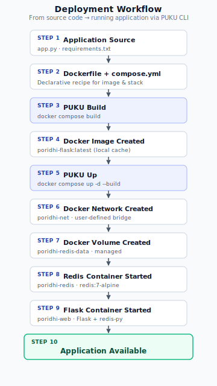
---

## 6.3 Verifying PUKU CLI Workspace Context

Before using PUKU CLI to automate deployment tasks, it is important to verify that the CLI has access to the correct project directory and understands the current workspace. This initial verification helps ensure that PUKU CLI is operating on the intended project and reduces the risk of executing automation commands in the wrong location.

A simple way to perform this verification is to ask PUKU CLI to inspect the current working directory and describe what it finds. For example:

```text
Can you see the contents of the current working directory? Based on the files present, what do you think I am trying to build? Your task is to help me on that project
```

### Purpose

This prompt encourages PUKU CLI to:

- Read the contents of the current working directory.
- Identify important project files such as:
  - `Dockerfile`
  - `compose.yml`
  - `app.py`
  - `requirements.txt`
- Infer the purpose of the project from the available files.
- Confirm that it understands the project's structure before performing any automation tasks.

### Expected Response
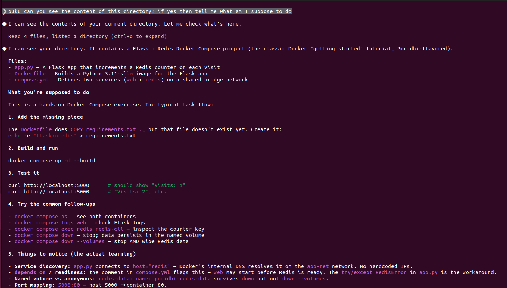

### Benefits

Performing this verification before deployment provides several advantages:

- Confirms that PUKU CLI is accessing the correct project directory.
- Ensures all required project files are visible.
- Verifies that the CLI correctly understands the project's objective.
- Detects potential workspace or permission issues before automation begins.
- Reduces the likelihood of executing deployment commands on the wrong project.
---


## 6.4 Building the Application

Before the application can be executed, Docker must build the Flask image using the Dockerfile.

The following command builds the application image:

```bash
puku build these services
```

### Explanation

This command performs the following tasks:

- Reads the Dockerfile.
- Downloads the required base image if it is not already available.
- Installs Python dependencies.
- Copies the application source code.
- Creates a reusable Docker image.

After completion, the application image is stored locally and is ready to be executed.

### Expected Response
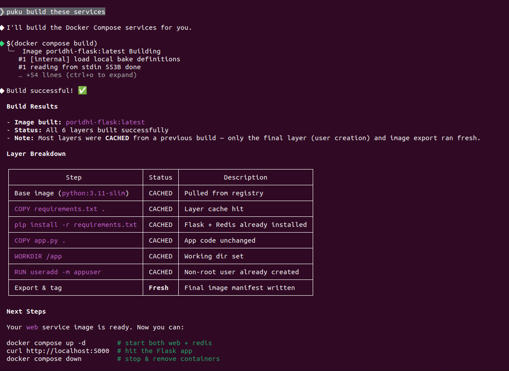
---

## 6.5 Starting the Application

Once the image has been built, the complete application can be started using:

```bash
puku up these services
```

### Explanation

This command automatically:

- Creates the Docker network.
- Creates the Docker volume.
- Starts the Redis container.
- Starts the Flask container.
- Connects both containers to the same network.
- Publishes port **5000** on the host machine.

After successful deployment, the application becomes accessible through:

```
http://localhost:5000
```
### Expected Response
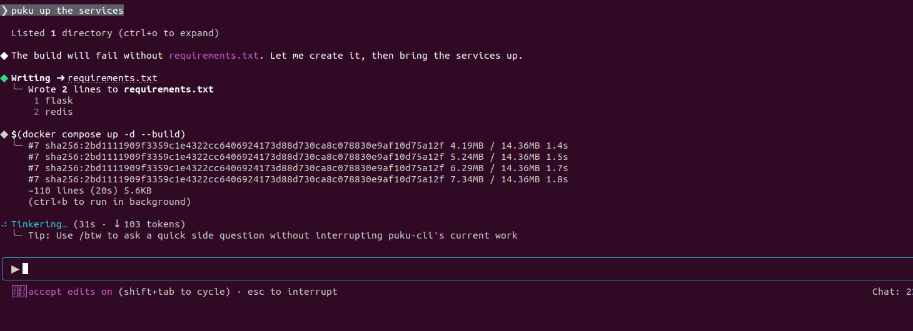

---

## 6.6 Running in Detached Mode

For long-running applications, containers are typically executed in detached mode.

```bash
puku up services with -d
```

### Explanation

Detached mode starts all containers in the background and immediately returns control to the terminal.

Benefits include:

- Terminal remains available.
- Containers continue running after the command finishes.
- Suitable for production and server deployments.

### Expected Response
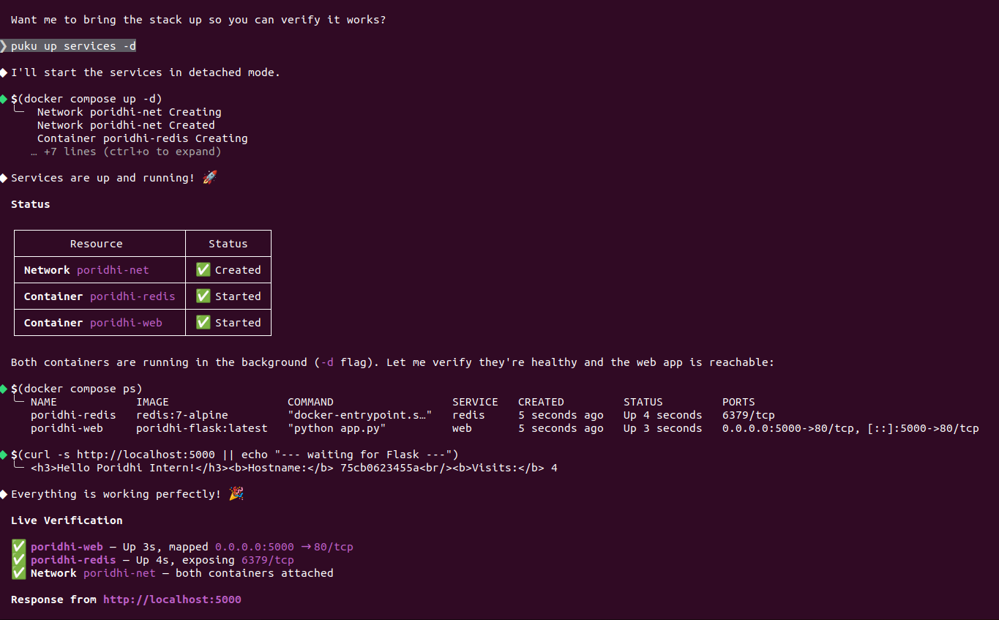
---

## 6.7 Viewing Running Containers

To verify that the application is running correctly, execute:

```bash
puku ps
```

### Explanation

This command displays:

- Running containers
- Container names
- Current status
- Published ports
- Uptime

### Expected Response
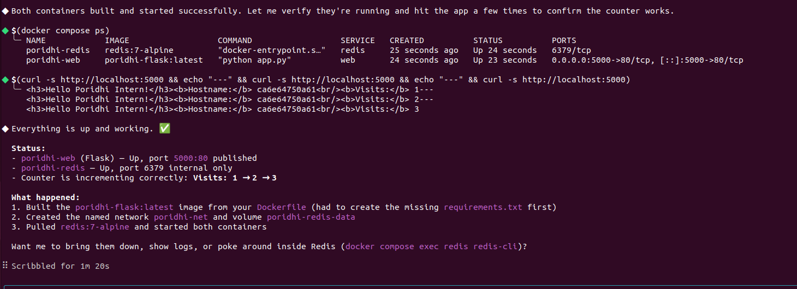
---

## 6.8 Viewing Application Logs

Application logs help monitor runtime activity and troubleshoot issues.

```bash
puku logs
```

### Explanation

This command displays the combined logs from all running containers.

Typical information includes:

- Flask startup messages
- HTTP requests
- Redis initialization
- Error messages
- Debug information

Logs are useful for verifying that services have started successfully.

### Expected Response
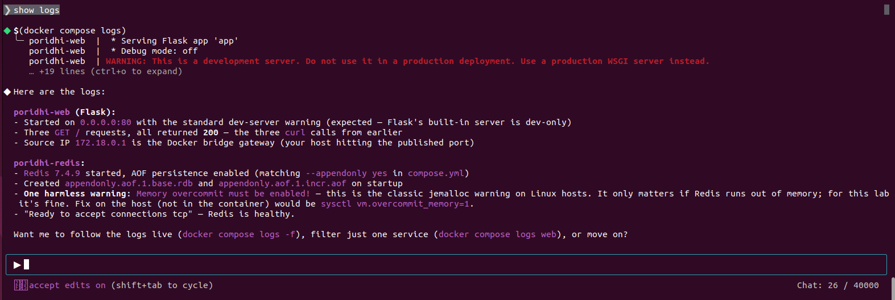
---

## 6.9 Stopping the Application

To stop all running containers without deleting them:

```bash
puku stop services
```

### Explanation

This command gracefully stops every container defined in the Compose project.

The containers remain available and can later be restarted without rebuilding.

### Expected Response
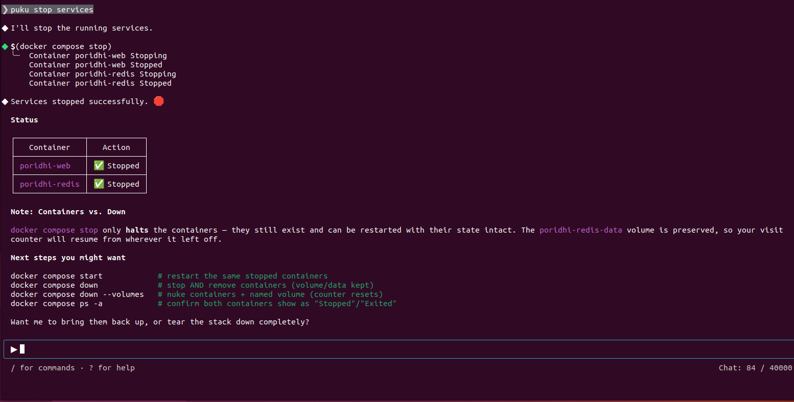
---

## 6.10 Restarting the Application

To restart previously stopped containers:

```bash
puku start services
```

### Explanation

This command starts the existing containers while preserving their configuration and stored data.

No image rebuild is required.

### Expected Response
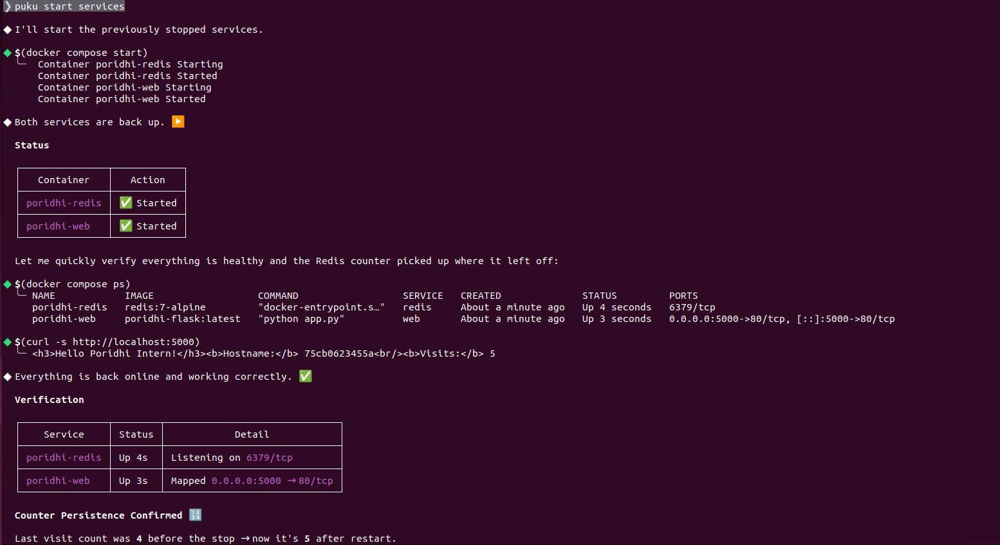
---

## 6.11 Removing the Application

When the application is no longer needed, all containers can be removed using:

```bash
puku down services
```

### Explanation

This command:

- Stops all containers.
- Removes containers.
- Removes the Docker network.

However, the Docker volume remains intact, so Redis data is preserved.

### Expected Response 
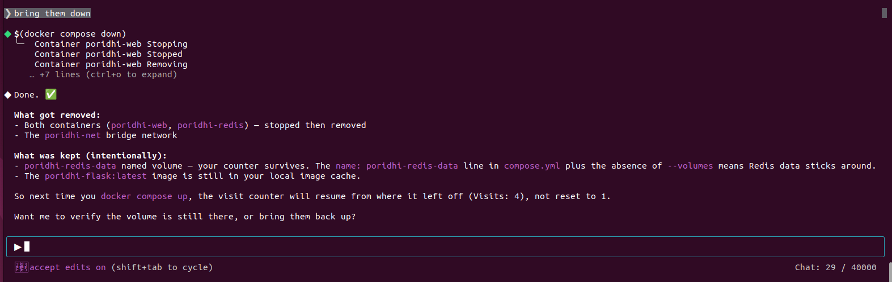
---

## 6.12 Removing Everything

To completely remove the deployment, including persistent storage:

```bash
puku down --volumes
```

### Explanation

This command removes:

- Containers
- Networks
- Named volumes

Since the Redis volume is deleted, all stored visit-counter data is permanently lost.

### Expected Response
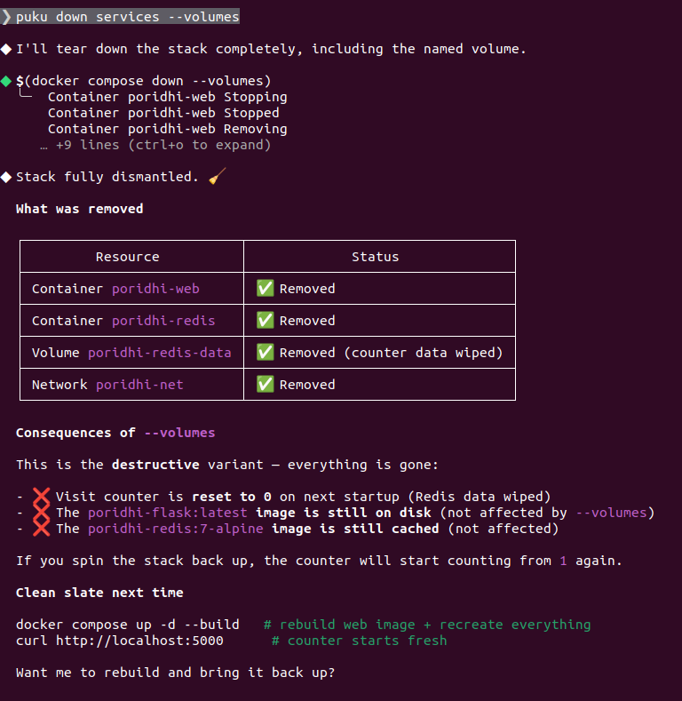
---

## 6.13 Deployment Verification

After deployment, the application can be verified using the following checklist:

| Verification Step | Expected Result |
|-------------------|-----------------|
| Build completed | Docker image created successfully |
| Containers running | Flask and Redis containers are active |
| Network created | Both containers are attached to `poridhi-net` |
| Volume created | `poridhi-redis-data` exists |
| Browser access | `http://localhost:5000` displays the application |
| Visit counter | Counter increases after every page refresh |

### Expected Output
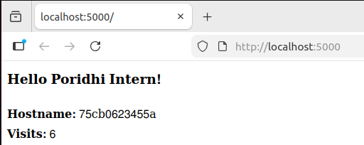
---

## 6.14 Summary

PUKU CLI streamlines the deployment and management of Docker Compose applications by automating common Docker operations. In this project, it simplifies building images, creating networks and volumes, starting services, monitoring containers, viewing logs, and cleaning up resources. By using a small set of intuitive commands, developers can deploy and manage the entire Flask–Redis application efficiently while maintaining a consistent and reliable workflow.

## Chapter 7: Verifying the End-to-End Behaviour

1. Open <http://localhost:5000> in a browser. You should see "Hello Poridhi Intern!" plus a visit count.
2. Refresh a few times. The visit count should tick up.
3. From another terminal, run `puku exec redis redis-cli` then `GET counter`. The value should match what the page shows.
4. Run `puku restart redis`, refresh the page. The count should **not** reset — proving the volume is doing its job.
5. Run `puku down` (no `--volumes`), then `puku up`. The count should still be there.
6. Run `puku down --volumes`, then `puku up`. The count resets to 1 — the named volume was deleted.

> If any step fails, jump to *Troubleshooting* below before continuing.

## Chapter 8: The Request Lifecycle

When a browser hits `http://localhost:5000/`:

1. Docker's port forwarder on the host routes the request into the `poridhi-web` container's port 80.
2. Flask's built-in server renders the template, calling `redis.incr("counter")` along the way.
3. The Python `redis` client opens a TCP connection to the hostname `redis`, which Docker's embedded DNS resolves to the `poridhi-redis` container's IP on `poridhi-net`.
4. Redis increments the counter key and asynchronously appends the change to `/data/appendonly.aof` on the named volume.
5. Flask renders the page and sends it back out the same path in reverse.

The whole round trip usually completes in a few milliseconds.

## Epilogue: The Complete System

After `puku up --build`, the running system looks like this:

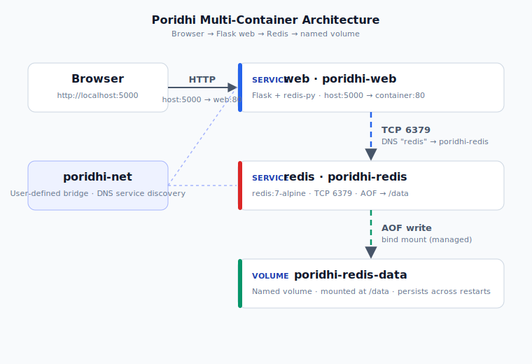

Both containers are on the `poridhi-net` bridge network. The Flask image was built locally; the Redis image was pulled from Docker Hub. State lives in a single named volume. Removing the stack with `puku down --volumes` would erase the counter; removing it with `puku down` would preserve it.

## The Principles

A few patterns from this lab that show up everywhere in container land:

- **One process per container.** Flask and Redis are separate services because they scale, fail, and update independently. Combine them and you give up most of the benefits of containers.
- **Declare, don't script.** The whole stack is described in `compose.yaml`. There is no shell script that has to be kept in sync with the application. The configuration *is* the documentation.
- **Service names are the contract.** `app.py` only knows about the string `"redis"`. The host, port, image, and restart policy are all configuration concerns that live outside the application.
- **Volumes are for state; the union filesystem is for code.** Anything you want to survive a container restart or a `puku down` (without `--volumes`) goes in a named volume or a bind mount.
- **Layer caching is a build-time optimisation, not a runtime feature.** Order your Dockerfile steps from least-changing to most-changing.
- **Defaults are dangerous.** `depends_on` does not wait for readiness. `EXPOSE` does not publish. `restart: no` is the Compose default. Always read the docs for the *behaviour you did not get for free*.
- **PUKU is a wrapper, not a replacement.** When PUKU is silent about a flag, the underlying `docker compose` flag still works. When in doubt, run `puku help <command>`.

## Troubleshooting

**`puku: command not found`**
PUKU is not on your `PATH`. Reinstall or source the PUKU profile script from your shell rc file.

**`docker: command not found` / `docker compose: command not found`**
Install Docker Desktop (or the engine + compose plugin). Restart the terminal after install.

**`bind: address already in use` on port 5000**
Something on the host is already listening on 5000. Either stop it, or change the **left** side of `ports: ["5000:80"]` to another port, e.g. `"8080:80"`, and reload the page on the new port.

**The page loads but the visit count shows the "could not connect" HTML**
The Flask container cannot reach the Redis container. Check:
- `puku ps` — is the `redis` service actually running?
- `puku logs redis` — did Redis crash on startup?
- `docker network inspect poridhi-net` — are both containers attached?
- The hostname in `app.py` is exactly `"redis"` (the service name), **not** `localhost` or `127.0.0.1`.

**Counter resets every time I restart**
You are either starting a fresh volume (a different name) or running `puku down --volumes` between sessions. Use `puku down` (without `--volumes`) or `puku restart redis` to keep the volume.

**Image rebuilds every time, even when I only changed `app.py`**
Your `.dockerignore` is missing or invalid, so the build context keeps changing. Add at least:

```text
.git
__pycache__
*.pyc
.venv
venv
.env
*.md
```

**Windows: "open //./pipe/docker_engine: Access is denied"**
Docker Desktop is not running, or your user is not in the `docker-users` group. Start Docker Desktop and reopen the terminal.

**Linux: permission denied on `/var/run/docker.sock`**
Your user is not in the `docker` group. Either add yourself (`sudo usermod -aG docker $USER` then log out/in) or use `sudo` for each command (not recommended for daily use).

**Mac (Apple Silicon): wrong-architecture image warning**
You are pulling a `linux/amd64` image on an `arm64` host. Add `--platform=linux/arm64` to the service, or use a multi-arch image tag.

## Next Steps

Ideas for extending the lab:

1. Add an **Nginx** reverse proxy in front of Flask and terminate TLS with a self-signed certificate.
2. Replace the named volume with a **bind mount** to a local `./redis-data` directory so you can inspect AOF files with normal tools.
3. Add a **`Makefile`** (or `justfile`) with targets for `up`, `down`, `logs`, `shell`, and `reset`.
4. Scale the web tier: `puku up -d --scale web=3` and put a load balancer in front.
5. Add **healthchecks** and switch `depends_on` to the long-form `condition: service_healthy` syntax so Flask really waits for Redis to be ready:

   ```yaml
   web:
     depends_on:
       redis:
         condition: service_healthy
   redis:
     healthcheck:
       test: ["CMD", "redis-cli", "ping"]
       interval: 5s
       retries: 5
   ```

6. Migrate the same `compose.yaml` to **Kubernetes** with `kompose convert` to see how the concepts map.
7. Wire PUKU into a CI pipeline: `puku up --build` in CI, run integration tests, then `puku down --volumes` to leave a clean workspace.

## Additional Resources

- PUKU CLI — <https://puku.sh/docs/puku-cli/introduction>
- Docker Compose specification — <https://docs.docker.com/compose/compose-file/>
- Compose CLI reference — <https://docs.docker.com/compose/reference/>
- Docker bridge networks — <https://docs.docker.com/network/bridge/>
- Docker volumes — <https://docs.docker.com/storage/volumes/>
- Flask quickstart — <https://flask.palletsprojects.com/en/3.0.x/quickstart/>
- redis-py documentation — <https://redis-py.readthedocs.io/>
- Redis persistence (RDB vs AOF) — <https://redis.io/docs/latest/operate/oss_and_stack/management/persistence/>
- Dockerfile best practices — <https://docs.docker.com/build/building/best-practices/>
- Poridhi labs — <https://labs.poridhi.io>
